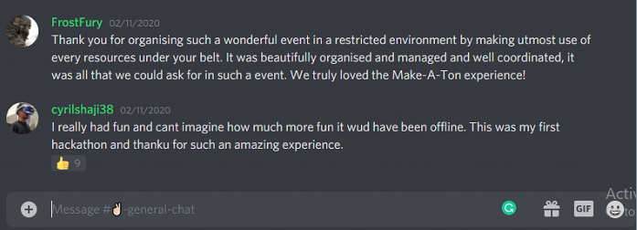
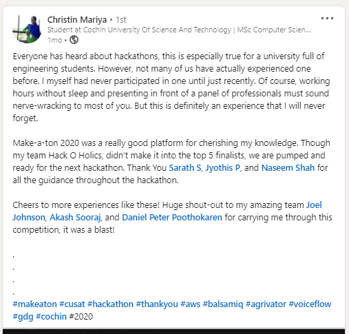
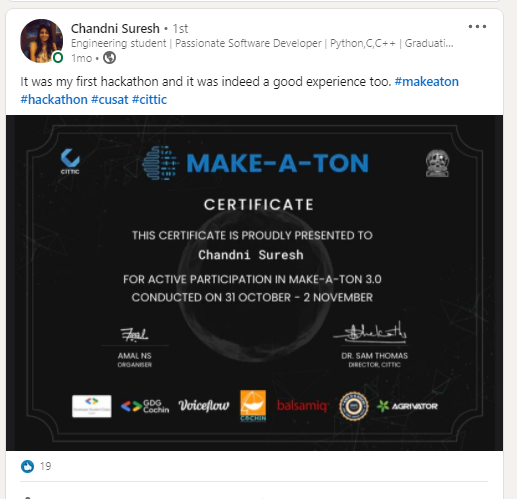
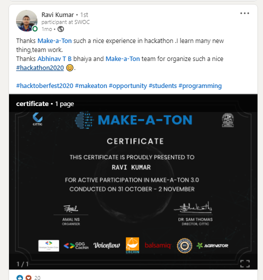
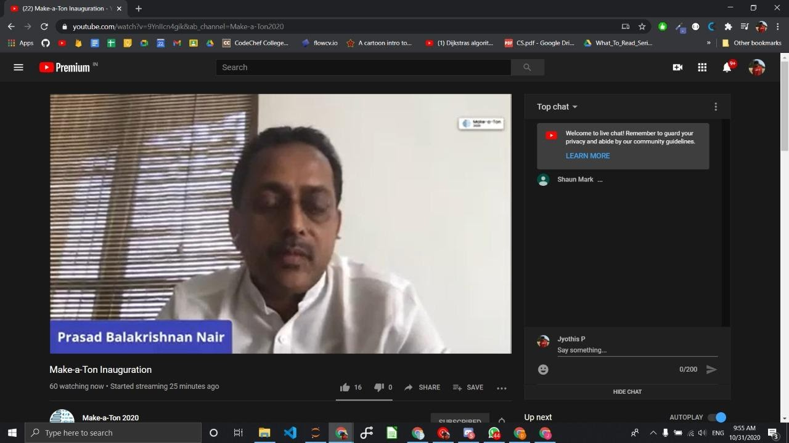
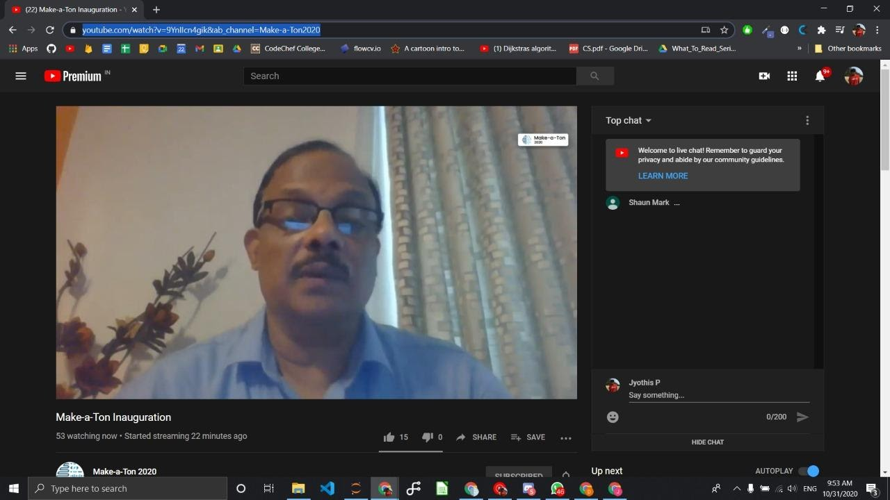

# Post Event Report MAKE-A-TON 2020 [31 OCT 2020 - 2 NOV 2020]

Make-a-Ton, conducted by the Centre for Innovation, Technology Transfer and Industrial Collaboration (CITTIC), was a 48-hour online hackathon organized with the aim to bring together phenomenal minds from different disciplines to embrace the spirit of innovation. The event was held from 31st October to 2nd November 2020. It was an open hackathon allowing teams to work on projects which they were passionate about. Additionally, there were two extra tracks namely social innovation for projects which have a social impact and Hack 4 CUSAT, a track exclusively for CUSAT students for solving problems related to the university. 

# Attendance 👯

The official event website went live on September 29th. The registrations were closed within the first week after receiving 130 registrations. The event enjoyed participation from students from different universities across the country. Until the registrations were closed, participants were given constant updates through the website, email correspondence and social media.

# Venue 🏫

It is the first time that it is being conducted online considering the global pandemic. Since it was conducted online, we were able to host a much wider palette of an audience with participants coming from all parts of the country.
Once the registrations closed, the stage was set for all the participants and organizers. Discord was used as the platform for hosting the two-day event. A well-structured discord server was created specifically for the event. It consisted of separate text and voice channels catering to the different needs of every participant. Separate channels were created for announcements and general chat. Each team was given a private channel to hold their discussions. There were also channels for games, music, and off-topic discussions. A resources channel was also set up to encourage shared learning. All the participants were invited into the server after registration.

# Planning vs Implementation 📎
Since it was a virtual hackathon, we planned the platform for communication to be Discord. We had milestone checks in between but since there were a lot of teams it took a bit more time than expected. 

Budget had been planned two months before the event and everything was properly covered.

We introduced an additional challenge to encourage participants to think out of the box and get out of their comfort zone. The swags from GitHub didnot arrive on time. We had printed Makeaton swags and those were the ones that were distributed to the participants.

# Positives 👍
- Students who were new to the hackathon benifited the most.
- We could bring real working people in the industry as mentors which was a great addtion to the hackathon. Mentors were guiding each team.
- Border reach of particpants.
- We implemented a continous evalution process through frequent milestone checks, which ensured every team is in right track. 

# Negatives 👎
- Lack of social interaction on a virtual event was a drawback.
- Entertaining events, games and other activites were a limitation
- Mentoring virtually was a challenging task.

# Feedback from Attendees 💬

  

==  

# What projects did students make with the GitHub Student Developer Pack?
Every team had to use Github since this event was online and participants were from different parts of the country. 
And since every team have used Github it was so easy for the organising team to view and verify the work that each team have done.

The first prize winner of Make-a-Ton was team CrackHack. They were awarded a cash prize of Rs.15,000. The team consisted of 3 members, Anito Anto, Abhishek and Abhijith P. Realizing how important it is for students to understand what they are taught and to make online learning much more fun and interactive, their idea was to create an interactive web platform in which teachers can interact with their students through video, and also with a real-time 3D model of the portion they are taking. They broke all bounds when they added a voice-based interface for students and teachers to interact with the 3D model.

Team Genic won the runners up prize. They were awarded a cash prize of Rs.10,000 They created an E-health platform for Doctors, clinics, and hospitals. The team of 3 students Joel Sunny Varghese, Roshni Rajan, and Akhil Biju from Sree Buddha College of Engineering, Pattoor. The project showcased an amazing user interface and a great number of features that can be seamlessly used by anyone using the app.

A special prize for the most socially impactful project was given to Team Schrodinger. They were awarded a cash prize of Rs.5000. The prize money of social innovation was sponsored by Agrivator. They developed an online teaching solution that can be used even with very low internet connectivity. The team of 3 students Rizwan Asif, Adarsh, and Abhiram from the photonics department. Their solution of making accessible online class/education for all by drastically reducing the bandwidth required by students, by replacing streaming slides with static images and instantly sync the view of teacher and student.

Team BroCode was awarded the ‘Hack 4 CUSAT’ prize for developing digital solutions catering to problems faced by students in the university. They were awarded a cash prize of Rs. 5,000. The team of 5 students from CUCEK built a platform that consisted of an array of features to solve campus-specific problems integrated with a voice interface.

# Social Media Drop
Here are some social media posts from the participants
1. https://www.linkedin.com/posts/chandnisuresh17_makeaton-hackathon-cusat-activity-6733106161261932544-O6DQ
2. https://www.linkedin.com/posts/christin-mariya-725800176_make-a-ton-2020-activity-6731980663584620544-UTLB
3. https://www.linkedin.com/posts/cyril-shaji-1778a61b9_makeaton-hackathon-tech-activity-6733096459266347008-Zh-t

# Photos

  
  
  

# Summary 💭
Every year Make-a-Ton makes it a point that the participants take something of value with them after the event. Make-a-Ton received a massive positive response from all its participants as it provided a platform for students to start their journey in innovation.  In short, Make-a-Ton was nothing less than a massive success!
